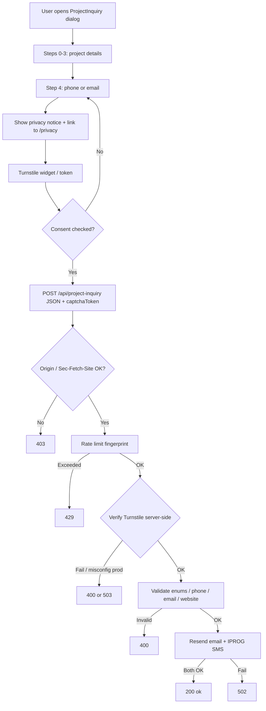

# Flow & data notes — Inquiry trust & hardening

**No application database.** Persistence remains mailbox + Resend + IPROG + Upstash rate counters. An ERD of tables is not applicable.

## Inquiry + privacy flow

## Data handled (unchanged + additions)

| Data | Stored where | Notes |
|------|----------------|-------|
| Inquiry fields | Email (Resend) | Existing |
| Short alert | IPROG SMS to env recipient | Existing; no free-text body |
| IP fingerprint hash | Upstash counter key | Existing; not form PII |
| Consent boolean | Not persisted in DB | **Inferred:** prove via server requiring `consent: true` on POST; optional log later out of scope |
| Captcha token | Ephemeral verify call to Cloudflare | New; do not log token |

## Subprocessors (privacy page must list)

- Resend — inquiry email delivery  
- IPROG SMS — operator alert  
- Upstash Redis — rate-limit counters  
- Host (e.g. Vercel) — request logs  
- Cloudflare Turnstile — bot verification (**new**, if chosen)
